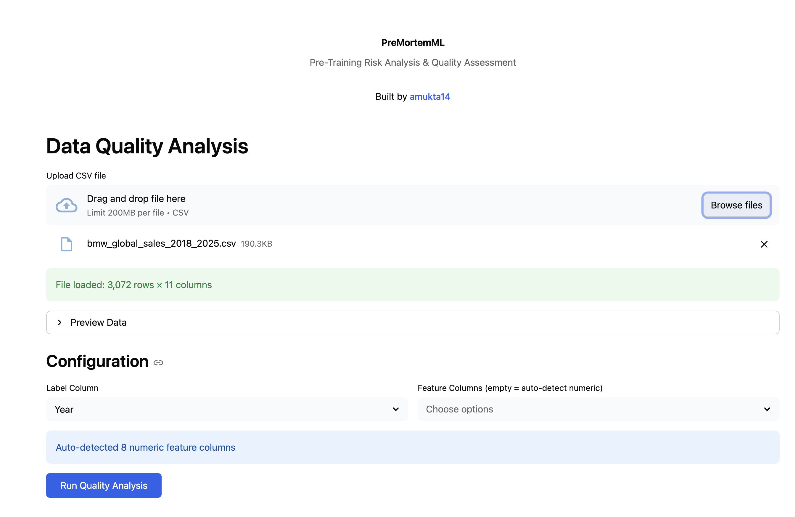
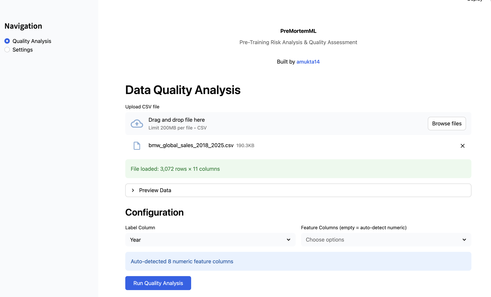
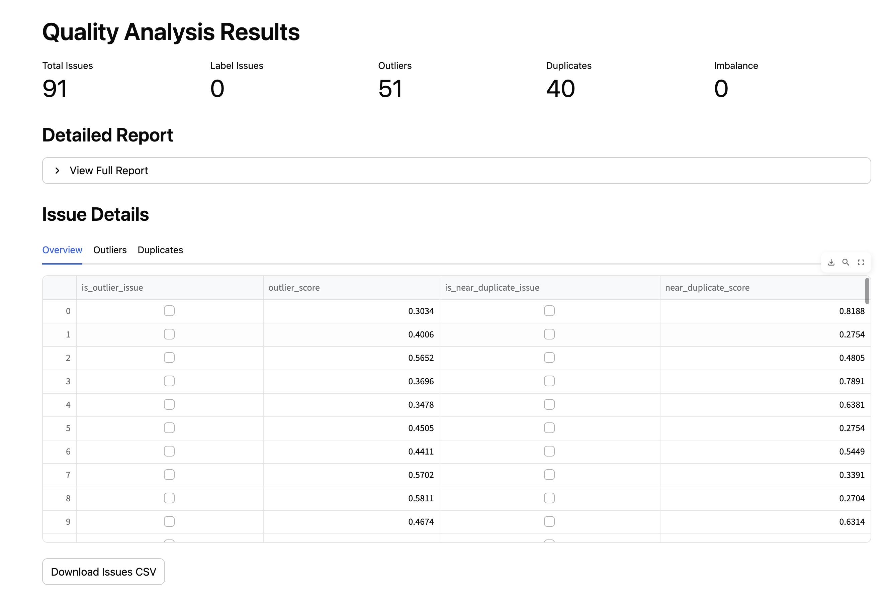
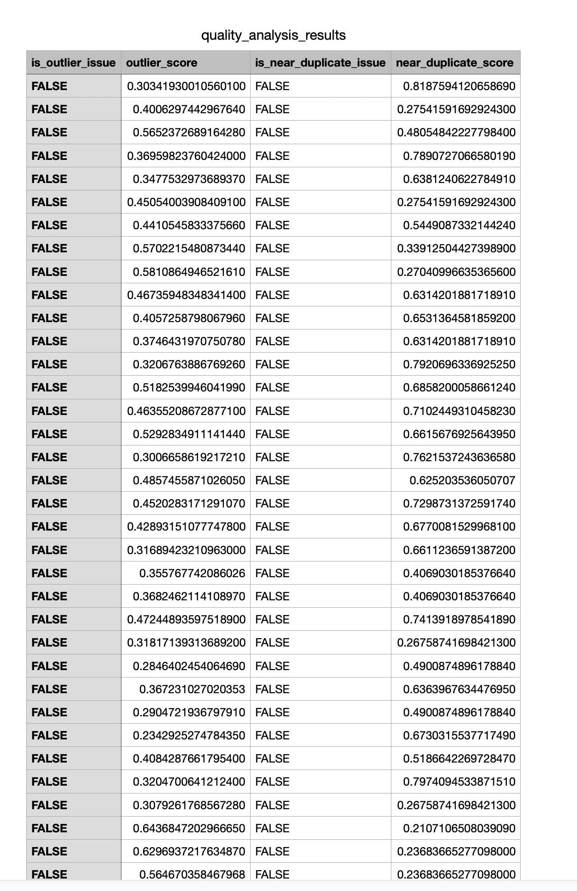
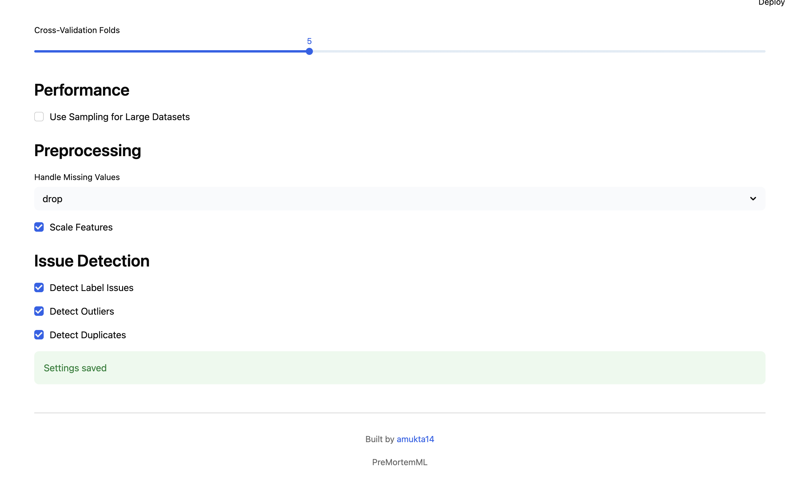

# PreMortemML – Data Insight Platform

PreMortemML is a data quality analysis platform designed to evaluate machine learning datasets before model training begins. The goal is to identify potential issues in the dataset that could negatively affect model performance, reliability, and downstream decision-making.

The platform performs automated checks for common data problems such as outliers, duplicate records, and class imbalance, allowing practitioners to inspect dataset quality early in the ML workflow.

Built as an interactive web interface using Streamlit, PreMortemML enables users to upload datasets, configure feature selections, run automated analysis, and review detected issues through structured reports and visual outputs.

---

# Overview

Machine learning performance is heavily dependent on dataset quality. Problems such as noisy samples, duplicated data points, or abnormal values can significantly degrade model performance.

PreMortemML provides a structured workflow for examining datasets before training begins. By detecting and summarizing potential issues, it helps practitioners understand the dataset and decide whether additional cleaning or preprocessing is required.

---

# Key Features

## 1. Dataset Upload and Configuration

Users can upload CSV datasets directly through the web interface. The system automatically reads the dataset structure and allows users to configure the analysis parameters.

Capabilities include:

* Upload CSV datasets through the interface
* Automatic detection of numeric feature columns
* Manual selection of label and feature columns
* Dataset preview before running analysis

### Interface



---

## 2. Automated Data Quality Analysis

Once configured, the platform runs automated checks to detect common data quality issues.

The analysis currently includes detection of:

* Outliers in numeric feature columns
* Near-duplicate samples
* Class imbalance in the label column
* Dataset structural statistics

The analysis summarizes the detected issues and provides an overview of dataset health.

### Dashboard



---

## 3. Issue Inspection and Detailed Reports

After running the analysis, users can inspect detected issues in detail.

The platform provides:

* Summary statistics of detected problems
* Issue counts for each category
* Row-level inspection of problematic samples
* Exportable issue reports

Users can also download the detected issues as a CSV file for further investigation.

### Detailed Issue View



Here's the CSV export preview:



---

## 4. Configurable Analysis Settings

The platform allows users to adjust analysis behavior through configuration options.

These settings include:

* Cross-validation fold configuration
* Sampling options for large datasets
* Missing value handling
* Feature scaling
* Selection of issue detection modules

### Settings Panel



---

# Tech Stack

## Core Platform

* Python 3.10+
* Streamlit – interactive web interface

## Data Processing and Analysis

* pandas – dataset handling and manipulation
* numpy – numerical operations
* scikit-learn – preprocessing utilities and validation tools

## Visualization

* matplotlib
* seaborn

## Utility Libraries

* tqdm – progress tracking for long operations
* termcolor – formatted terminal output

---

# Project Structure

```text
.
├── data_insight_platform.py
├── premortemml/
│   └── core data analysis package
├── platform_requirements.txt
├── start_platform.sh
└── README.md
```

---

# Installation

Install the required dependencies:

```bash
pip install -r platform_requirements.txt
pip install -e .
```

---

# Running the Platform

Start the Streamlit application:

```bash
streamlit run data_insight_platform.py
```

Or use the provided script:

```bash
./start_platform.sh
```

Once the server starts, open:

```text
http://localhost:8501
```

Upload a dataset and run the analysis through the interface.

---

# Author

Built by **amukta14**
